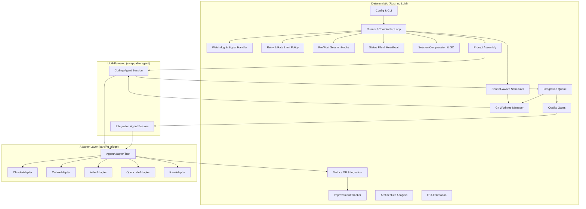
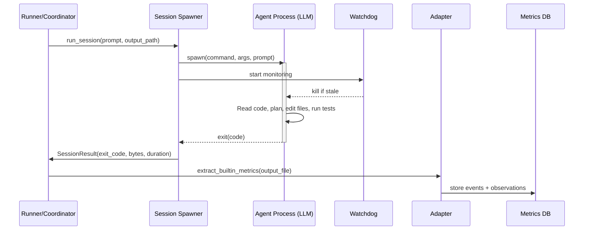
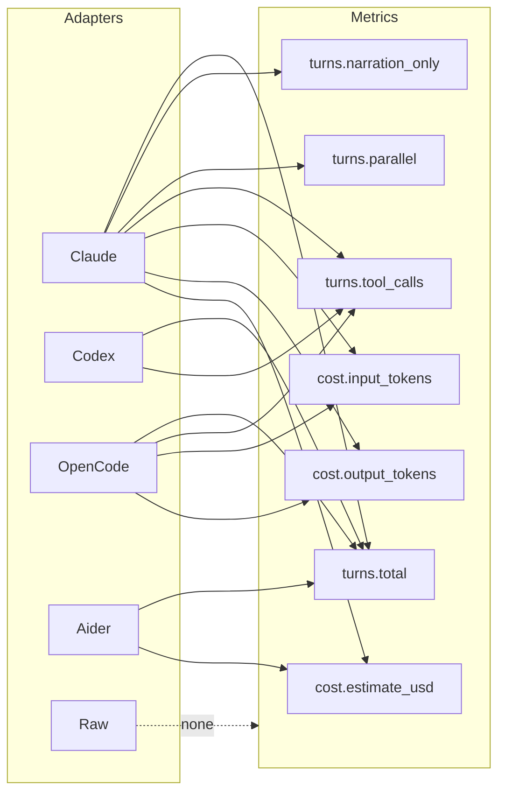
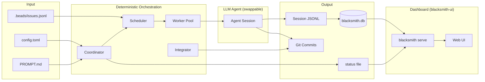

# Architecture Overview

How blacksmith's deterministic orchestration layer interacts with LLM-powered agents, and what's swappable.

## System Boundary



## What's Deterministic (No LLM)

Everything except spawning the agent process. The entire orchestration layer is pure Rust code making deterministic decisions:

| Module | Role | Key files |
|---|---|---|
| **Runner** | Serial mode loop: spawn session, check output, retry/proceed | `runner.rs` |
| **Coordinator** | Parallel mode: assign beads to workers, poll completions | `coordinator.rs` |
| **Scheduler** | Pick next bead for idle worker, avoid file-set conflicts | `scheduler.rs` |
| **Session** | Spawn agent subprocess, pipe prompt, capture output | `session.rs` |
| **Watchdog** | Kill stale sessions (no output for N minutes) | `watchdog.rs` |
| **Signals** | Handle SIGINT/SIGTERM for graceful shutdown | `signals.rs` |
| **Retry** | Decide retry/skip/proceed based on output size + exit code | `retry.rs` |
| **Rate Limit** | Detect rate-limit patterns, exponential backoff | `ratelimit.rs` |
| **Integrator** | Merge worktree → main, run quality gates, fix loop | `integrator.rs` |
| **Quality Gates** | Run `cargo check`, `cargo test`, etc. (configurable) | `config.rs`, `integrator.rs` |
| **Worktree** | Create/cleanup git worktrees per worker | `worktree.rs` |
| **Pool** | Track worker lifecycles, spawn/reap processes | `pool.rs` |
| **Hooks** | Run shell commands before/after each session | `hooks.rs` |
| **Prompt** | Assemble prompt from file + prepend_commands + brief | `prompt.rs`, `brief.rs` |
| **Status** | Atomic JSON status file for observability | `status.rs` |
| **Metrics** | Ingest session output, extract metrics, store in SQLite | `ingest.rs`, `metrics.rs`, `db.rs` |
| **Improvements** | Track/promote operational insights | `improve.rs` |
| **Estimation** | ETA from dependency DAG + historical timing | `estimation.rs` |
| **Architecture** | Fan-in, god files, circular deps, boundary violations | `fan_in.rs`, `god_file.rs`, `circular_dep.rs`, etc. |
| **Compression** | zstd compress old session files | `compress.rs` |
| **Retention/GC** | Delete sessions beyond retention window | `retention.rs`, `gc.rs` |
| **Serve** | HTTP API + UDP heartbeat for dashboard | `serve.rs` |

## What's LLM-Powered

Exactly two touchpoints where an LLM is invoked:

### 1. Coding Sessions

The runner/coordinator spawns an agent process and waits for it to exit. The agent gets:
- An assembled prompt (project instructions + performance brief + bead task description)
- A working directory (either the project root or a git worktree)
- Stdout/stderr redirected to a JSONL session file

The agent does all the "thinking" — reading code, planning, writing files, running tests. Blacksmith has zero visibility into what happens inside the session. It only observes:
- Exit code
- Output file size (empty = retry)
- Output file contents (parsed post-hoc by the adapter for metrics)

### 2. Integration Fix Sessions

When a completed worktree fails quality gates after merge (compilation errors, test failures), the integrator can optionally spawn an agent to fix the conflicts. This uses the same session spawning mechanism but with:
- A different prompt (the error output + "fix these errors")
- The `[agent.integration]` config (can be a different command/model)
- A retry limit (circuit breaker after N failed attempts)



## The Adapter Layer: What's Swappable

The `AgentAdapter` trait is the boundary between blacksmith and any agent:

```rust
pub trait AgentAdapter: Send + Sync {
    fn name(&self) -> &str;
    fn extract_builtin_metrics(&self, output_path: &Path)
        -> Result<Vec<(String, Value)>, AdapterError>;
    fn supported_kinds(&self) -> Vec<String>;
}
```

Blacksmith doesn't care what agent runs. It spawns a subprocess, captures output, and asks the adapter to parse it. Switching agents is a config change:

```toml
# Claude (default)
[agent]
command = "claude"
args = ["-p", "{prompt}", "--dangerously-skip-permissions", "--output-format", "stream-json"]

# Codex
[agent]
command = "codex"
args = ["exec", "--json", "--yolo", "{prompt}"]
adapter = "codex"

# Aider
[agent]
command = "aider"
args = ["--message", "{prompt}", "--yes-always"]
adapter = "aider"

# Any CLI tool
[agent]
command = "my-custom-agent"
args = ["{prompt}"]
adapter = "raw"
prompt_via = "stdin"  # or "arg" or "file"
```

### What each adapter provides



| Adapter | Metrics | Notes |
|---|---|---|
| **Claude** | Full (turns, tokens, cost, narration, parallel) | Parses stream-json JSONL natively |
| **Codex** | Partial (turns, tool calls) | No cost/token data in output |
| **OpenCode** | Partial (turns, tool calls, tokens) | Token counts when available |
| **Aider** | Partial (turns, cost) | Cost from chat log |
| **Raw** | None (harness metadata only) | Use custom extraction rules for anything |

Missing metrics are silently skipped. The brief, targets, and dashboard automatically adapt to what the current adapter can provide.

### Phase-specific agents

You can use different agents for coding vs integration:

```toml
[agent]
command = "claude"  # default for coding

[agent.integration]
command = "codex"   # cheaper model for fixing merge conflicts
```

## What's Claude Code Specific

Nothing in blacksmith's Rust code is Claude-specific. However, the default configuration assumes Claude Code:

| Default | Claude-specific? | Swappable? |
|---|---|---|
| `command = "claude"` | Yes — assumes `claude` CLI | Config: `[agent] command` |
| `args = ["-p", "{prompt}", "--dangerously-skip-permissions", "--output-format", "stream-json"]` | Yes — Claude CLI flags | Config: `[agent] args` |
| `ClaudeAdapter` parses stream-json | Yes — Claude's output format | Config: `[agent] adapter` |
| Prompt format (markdown with sections) | Agent-agnostic | Any agent reads markdown |
| `bd` (beads) task tracking | Agent-agnostic | Shell CLI, not Claude-specific |
| Quality gates (`cargo check/test`) | Language-specific, not agent-specific | Config: `[quality_gates]` |

**The only Claude dependency is the default config values.** Change `[agent]` and you're running a completely different LLM.

## Data Flow Summary


